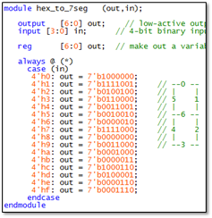
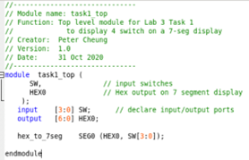
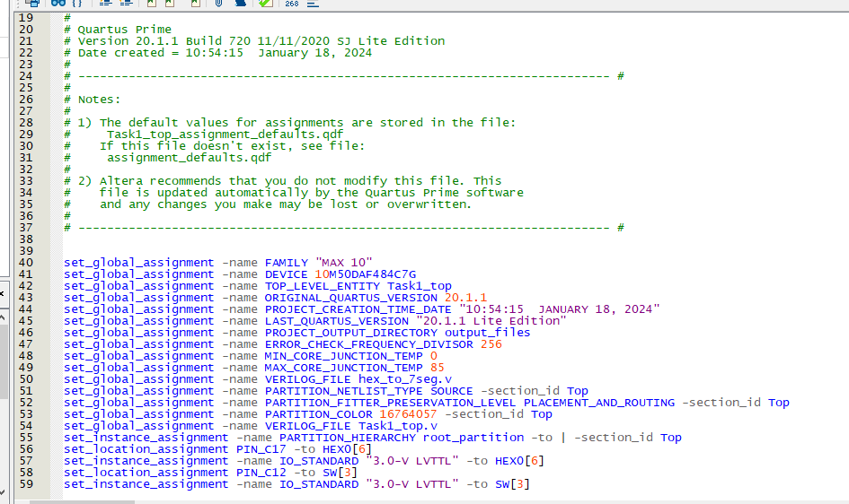
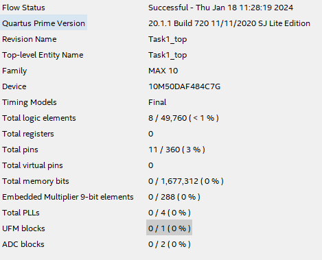
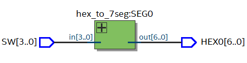
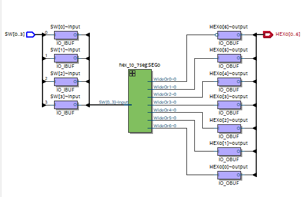
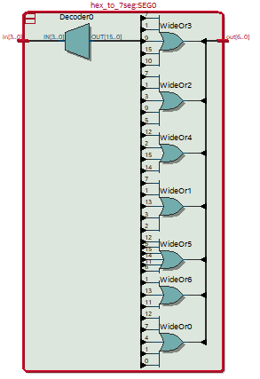
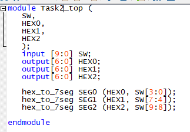
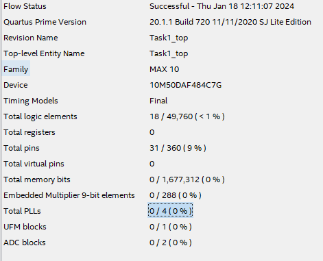

# Lab 1 Coursework #

## Task 1 ## 

We started by writing the following verilog code for the hex to 7 segement decoder:

And the following top file:

Our next task was completing the pin assignment manually, which can be seen in the .qsf file (Quartus Setting File). The screenshot below shows the .qsf file:

*Note: The final 4 lines indicate the assignment*

Following the pin assignment we compiled the program. We needed to show the following:

1. Show the design uses 8 logic elements (out of nearly 50,000)
2. And the design used 11 pins

Below is proof of this - via the compilation report / flow summary:

INSERT VIDEO HERE

---
## Task 2 ##

Below is the RTL View, of the hex to 7 segment decoder:

Below is the Tech-map viewer:

Below is the synthesised view:

We can see from the Tech-map that there are 11 pins in use given the 4 I/Ps from the switch and the 7 HEX O/Ps.

We can also see the 8 logical components being used from the synthesised view with the 7 OR gates and 1 Decoder.

### **NEED TO DO TIMING ANALYSER** ###

We now created a top file to display all 10-bit sliding switches as hexadecimal on 3 of the 7 segment LED displays:

Now we have defined the O/P for the extra 2, 7 segment digits called HEX1 and HEX2. Then we instantiate 2 new hex_to7seg modules which output the 7:4 bits of the switch input to HEX1 and the 9:8 bits of the switch input to HEX2.

Finally we performed a test of the extended program, below is a video of the testing and the compilation report:

INSERT VIDEO HERE