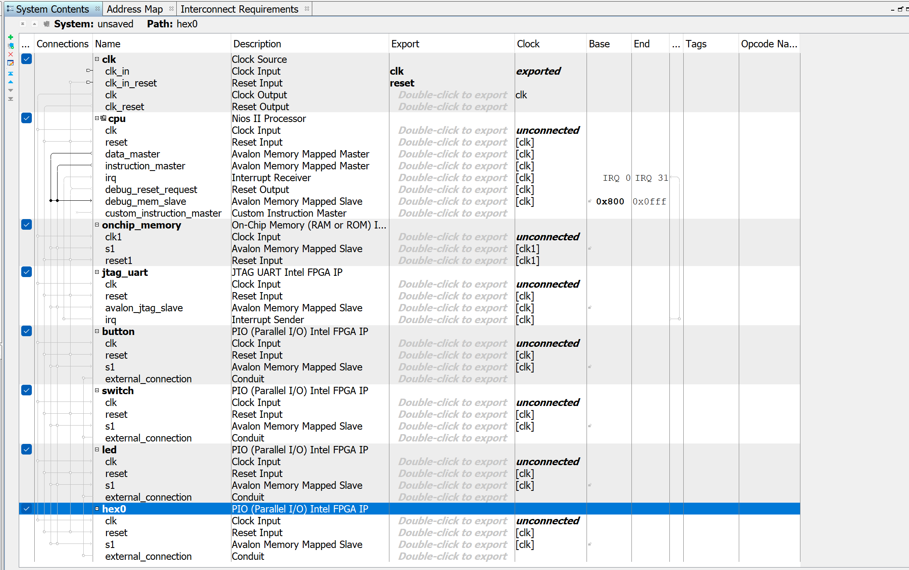
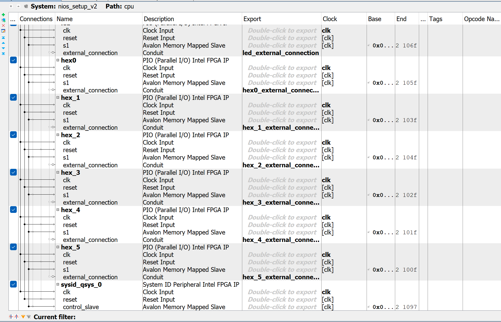
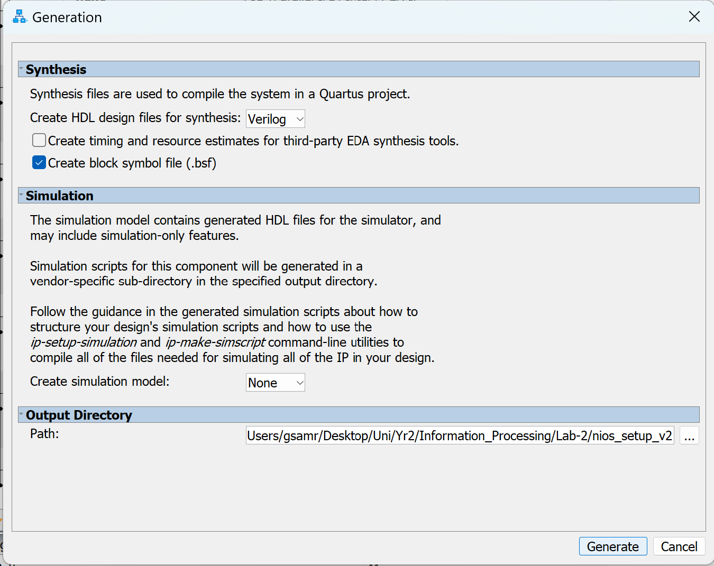
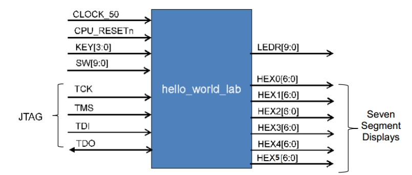
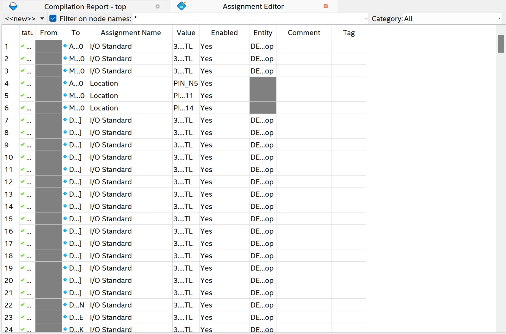
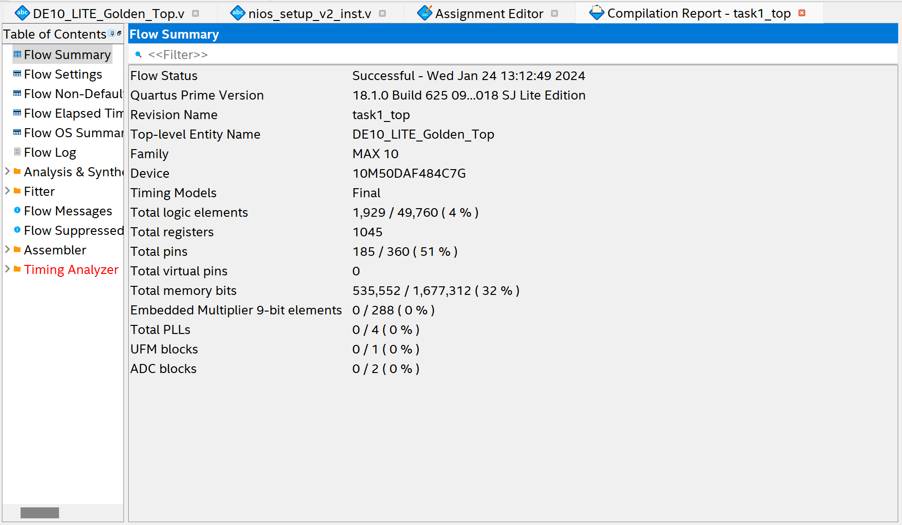
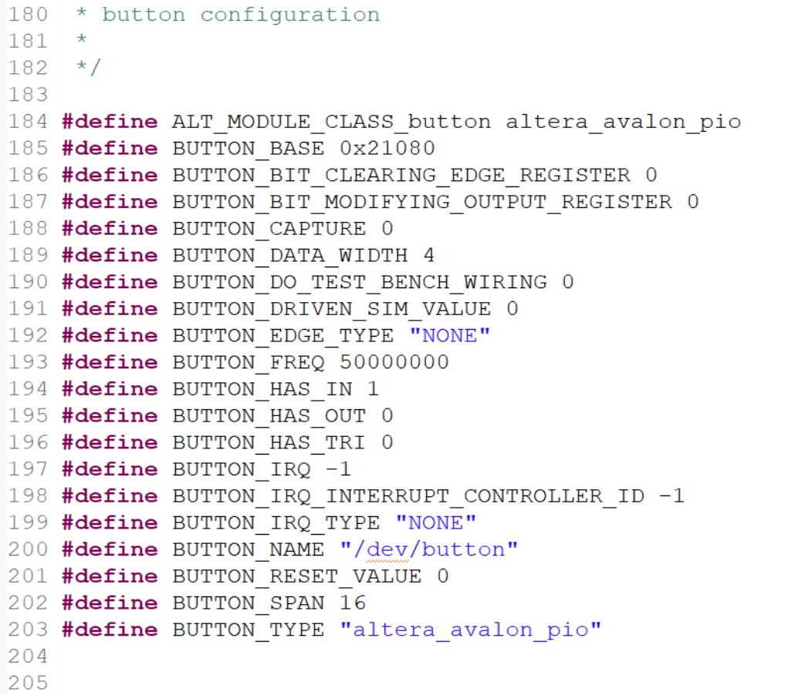
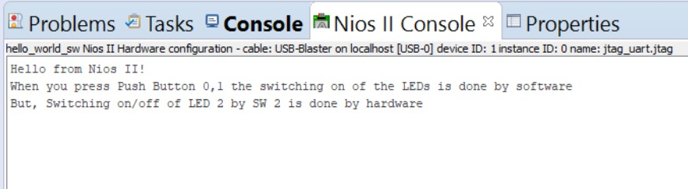

# Lab 2 Coursework #

## Task 1 ## 

Our goal is to instsantiate a soft processor on our FPGA, we started by adding all the main components we need, including those for the I/O funtionality.

We added them to the system contents page as shown below:



The components included:
- A system clock
- A CPU
- Memory module
- A button (peripheral)
- A switch
- LED control (peripheral)
- And 6 Hex components corresponding to the 7 segment displays (peripherals)
- sysid_qsys_0

We then connected the components together as shown and assigned base address:




We also set the reset vector memort and expecption vector memory to onchip_memory.s1 - This ensures the system will execute from onchip memory.

We then generated the verilog files:



We now had to bind our Qsys system and Verilog code together, synthesised it will look similar to the following diagram:



The template for the top level file was provided and is shown below:

``` verilog
//=======================================================
//  This code is generated by Terasic System Builder
//=======================================================

module DE10_LITE_Golden_Top(

	//////////// CLOCK //////////
	input 		          		ADC_CLK_10,
	input 		          		MAX10_CLK1_50,
	input 		          		MAX10_CLK2_50,

	//////////// SDRAM //////////
	output		    [12:0]		DRAM_ADDR,
	output		     [1:0]		DRAM_BA,
	output		          		DRAM_CAS_N,
	output		          		DRAM_CKE,
	output		          		DRAM_CLK,
	output		          		DRAM_CS_N,
	inout 		    [15:0]		DRAM_DQ,
	output		          		DRAM_LDQM,
	output		          		DRAM_RAS_N,
	output		          		DRAM_UDQM,
	output		          		DRAM_WE_N,

	//////////// SEG7 //////////
	output		     [7:0]		HEX0,
	output		     [7:0]		HEX1,
	output		     [7:0]		HEX2,
	output		     [7:0]		HEX3,
	output		     [7:0]		HEX4,
	output		     [7:0]		HEX5,

	//////////// KEY //////////
	input 		     [1:0]		KEY,

	//////////// LED //////////
	output		     [9:0]		LEDR,

	//////////// SW //////////
	input 		     [9:0]		SW,

	//////////// VGA //////////
	output		     [3:0]		VGA_B,
	output		     [3:0]		VGA_G,
	output		          		VGA_HS,
	output		     [3:0]		VGA_R,
	output		          		VGA_VS,

	//////////// Accelerometer //////////
	output		          		GSENSOR_CS_N,
	input 		     [2:1]		GSENSOR_INT,
	output		          		GSENSOR_SCLK,
	inout 		          		GSENSOR_SDI,
	inout 		          		GSENSOR_SDO,

	//////////// Arduino //////////
	inout 		    [15:0]		ARDUINO_IO,
	inout 		          		ARDUINO_RESET_N,

	//////////// GPIO, GPIO connect to GPIO Default //////////
	inout 		    [35:0]		GPIO
);


//=======================================================
//  REG/WIRE declarations
//=======================================================


//=======================================================
//  Structural coding
//=======================================================


endmodule
```

We then had to fill in the 'REG/WIRE declarations' and 'Structural coding' gaps. First the 'REG/WIRE declarations' gap:

``` verilog
//=======================================================
//  REG/WIRE declarations
//=======================================================

nios_setup_v2 u0 (
		.clk_clk                           (MAX10_CLK1_50),     // clk.clk
		.reset_reset_n                     (1'b1),              // reset.reset_n
		.button_external_connection_export (KEY[1:0]),          // button_external_connection.export
		.switch_external_connection_export (SW[9:0]),           // switch_external_connection.export
		.led_external_connection_export    (LEDR[9:0]),         // led_external_connection.export
		.hex0_external_connection_export   (HEX0),              // hex0_external_connection.export
		.hex_1_external_connection_export  (HEX1),              // hex_1_external_connection.export
		.hex_2_external_connection_export  (HEX2),              // hex_2_external_connection.export
		.hex_3_external_connection_export  (HEX3),              // hex_3_external_connection.export
		.hex_4_external_connection_export  (HEX4),              // hex_4_external_connection.export
		.hex_5_external_connection_export  (HEX5)               // hex_5_external_connection.export
	);
```

*Note: Here we are instantiating the qsys system (NIOS2 CPU System) and connecting it with the higher level module*

We can see hpw the pins are assigned via the assingment editor:



We were now ready to compile, the compilation report can be seen below:



---
## Task 2 ##

In task 2 we work on building the software for the 'Hello World' design.

We built the following 'Hello World' Code:

``` C
#include <sys/alt_stdio.h>
#include <stdio.h>
#include "altera_avalon_pio_regs.h"
#include "system.h"

int main()
{
	int switch_datain;
	alt_putstr("Hello from Nios II!\n");
	alt_putstr("When you press Push Button 0,1 the switching on of the LEDs is done by software\n");
	alt_putstr("But, Switching on/off of LED 2 by SW 2 is done by hardware\n");
	/* Event loop never exits. Read the PB, display on the LED */

	while (1)
	{
		//Gets the data from the pb, recall that a 0 means the button is pressed
		switch_datain = ~IORD_ALTERA_AVALON_PIO_DATA(BUTTON_BASE);
		//Mask the bits so the leftmost LEDs are off (we only care about LED3-0)
		switch_datain &= (0b0000000011);
		//Send the data to the LED
		IOWR_ALTERA_AVALON_PIO_DATA(LED_BASE,switch_datain);

	}
	return 0;
}

```

Below is a table explaining the program:

| Program Part | Explaination 																						 |
| ------------ | :----------- 																						 |
| alt_putstr   | Writes text to terminal (used over C printf function because it is more compact using HAL commands) |
| IOWD_ALTERA_AVALON_PIO_DATA(Location) | Gets data from specified location and reads it into a variable 			 |
| IORR_ALTERA_AVALON_PIO_DATA(Location, Value) | Writes the numeric Value to the given Location 					 |
| BUTTON_BASE  | Variable created by by importing the information from .sopcinfo file  							     |
| LED_BASE     | Variable created by by importing the information from .sopcinfo file  							     |

The defined variables were found in the system.h file, as shown below:



After running the code we got the following terminal O/P:



Also shown is a video of us getting the LEDs working


https://github.com/AlexSeferidis/IP_Labs/assets/123762865/b697d5a3-89fa-4baa-8d0b-cd33911b2638


In order to do this we added the following code:

``` Verilog
nios_setup_v2 u0 (
		.clk_clk                           (MAX10_CLK1_50),                           //                        clk.clk
		.reset_reset_n                     (1'b1),                     //                      reset.reset_n
		.button_external_connection_export (KEY[1:0]), // button_external_connection.export
		.switch_external_connection_export (SW[9:0]), // switch_external_connection.export
		.led_external_connection_export    (ledFromNios[9:0]),    //    led_external_connection.export
		.hex0_external_connection_export   (HEX0),   //   hex0_external_connection.export
		.hex_1_external_connection_export  (HEX1),  //  hex_1_external_connection.export
		.hex_2_external_connection_export  (HEX2),  //  hex_2_external_connection.export
		.hex_3_external_connection_export  (HEX3),  //  hex_3_external_connection.export
		.hex_4_external_connection_export  (HEX4),  //  hex_4_external_connection.export
		.hex_5_external_connection_export  (HEX5)   //  hex_5_external_connection.export
	);


//=======================================================
//  Structural coding
//=======================================================


	assign LEDR[2] = SW[2];


   wire [9:0] ledFromNios;
	assign LEDR[1:0] = ledFromNios[1:0];
	assign LEDR[9:3] = ledFromNios[9:3];

```

This added an intermediete wire between the LED and the switch which allowed us to control LED[2] using SW[2]. We then made sure the other LEDR signals were assigned as normal.

## Task 3 ##
