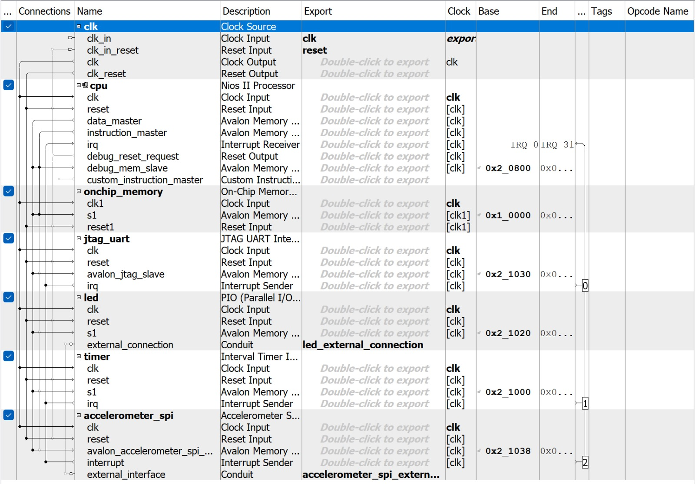
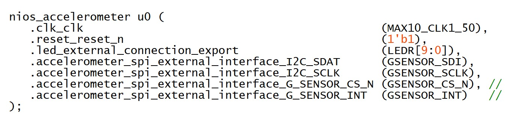
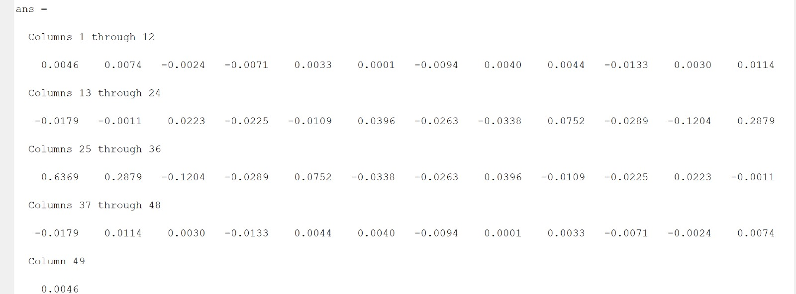
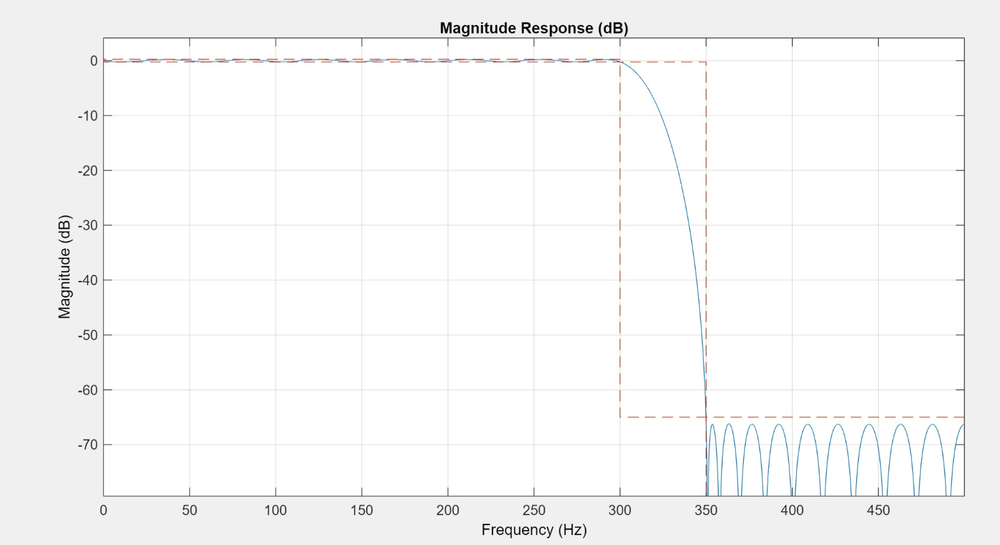

# Lab 3 Coursework #

## Task 1 ## 

The first objective was to show how you can interface the NIOS processor with an accelerometer.

First we connected the Accelerometer (SPI) to export enternal connections:



And then we instantiated it in the top file, defining its I/Ps and O/Ps:



Then by copying in some existing code and building the project we got the following O/P:


https://github.com/AlexSeferidis/IP_Labs/assets/123762865/db842eab-9043-4fb5-8e38-db175cbb4435


---
## Task 2 ##

Now we had to familarise ourselves with the code:

``` C
#include "system.h"
#include "altera_up_avalon_accelerometer_spi.h"
#include "altera_avalon_timer_regs.h"
#include "altera_avalon_timer.h"
#include "altera_avalon_pio_regs.h"
#include "sys/alt_irq.h"
#include <stdlib.h>

#define OFFSET -32
#define PWM_PERIOD 16

alt_8 pwm = 0;
alt_u8 led;
int level;

void led_write(alt_u8 led_pattern) {
    IOWR(LED_BASE, 0, led_pattern);
}

void convert_read(alt_32 acc_read, int * level, alt_u8 * led) {
    acc_read += OFFSET;
    alt_u8 val = (acc_read >> 6) & 0x07;
    * led = (8 >> val) | (8 << (8 - val));
    * level = (acc_read >> 1) & 0x1f;
}

void sys_timer_isr() {
    IOWR_ALTERA_AVALON_TIMER_STATUS(TIMER_BASE, 0);

    if (pwm < abs(level)) {

        if (level < 0) {
            led_write(led << 1);
        } else {
            led_write(led >> 1);
        }

    } else {
        led_write(led);
    }

    if (pwm > PWM_PERIOD) {
        pwm = 0;
    } else {
        pwm++;
    }

}

void timer_init(void * isr) {

    IOWR_ALTERA_AVALON_TIMER_CONTROL(TIMER_BASE, 0x0003);
    IOWR_ALTERA_AVALON_TIMER_STATUS(TIMER_BASE, 0);
    IOWR_ALTERA_AVALON_TIMER_PERIODL(TIMER_BASE, 0x0900);
    IOWR_ALTERA_AVALON_TIMER_PERIODH(TIMER_BASE, 0x0000);
    alt_irq_register(TIMER_IRQ, 0, isr);
    IOWR_ALTERA_AVALON_TIMER_CONTROL(TIMER_BASE, 0x0007);

}

int main() {

    alt_32 x_read;
    alt_up_accelerometer_spi_dev * acc_dev;
    acc_dev = alt_up_accelerometer_spi_open_dev("/dev/accelerometer_spi");
    if (acc_dev == NULL) { // if return 1, check if the spi ip name is "accelerometer_spi"
        return 1;
    }

    timer_init(sys_timer_isr);
    while (1) {

        alt_up_accelerometer_spi_read_x_axis(acc_dev, & x_read);
        // alt_printf("raw data: %x\n", x_read);
        convert_read(x_read, & level, & led);

    }

    return 0;
}

```

The code intialises the intial orientation of the FPGA, then it constantly reads and updates the x value deviation from the Accelerometer and assigns it to a variable. Based on how that variable, x_read is changes we call the convert_read() function. This function takes the constantly updating x_value and updates the LEDs in a corresponding way.

It does this by subtracting the x reading by an offset of 32, we then shift this value to the right 6 times and mask the value with 0x07. This ensures that we take only the MSBs from the original value. This is done in the following code:

``` C
acc_read += OFFSET;
alt_u8 val = (acc_read >> 6) & 0x07;

```

This gives us a value of the range 0->7, which we can then use to assign to the LEDs. We then make the LEDs light up accordingly by using the following operation:

``` C

* led = (8 >> val) | (8 << (8 - val));

```

8 >> val: Right shifts the binary representation of the number 8 by the value of val. The val variable is extracted from the accelerometer data and limited to the range [0, 7] using the mask 0x07 earlier in the convert_read function. This right shift effectively creates a bitmask where the rightmost val bits are set to 0.

8 << (8 - val): Left shifts the binary representation of the number 8 by the complement of val with respect to 8 (i.e., 8 - val). This left shift creates a bitmask where the leftmost val bits are set to 0.

(8 >> val) | (8 << (8 - val)): Performs a bitwise OR operation between the results of the two shifts. This operation effectively combines the two bitmasks, creating a pattern where the bits corresponding to the range [0, val-1] and [8-val, 7] are set to 0, and the bits corresponding to the range [val, 8-val-1] are set to 1.

The final line simply performs a more precise calculation for the timer. The timer dictates when the writing to the LEDs is done as it performs an interrupt service routine to perform the write. 

The PWM control creates a smoother LED effect.

## Task 3 ##

In this section, we will add an FIR filter to perform a low-pass filtering of the accelerometer values. This meant we had to perform a convolution of the incoming raw data values and 1/TapNumber to create a moving average, low pass filter. We designed the filter using MATLAB to get the coeefecients and the frequency response:






Below is the function which implemented the filter:

Moving Average:

``` C
float applyFilter(float new_reading){
      static float filter[FILTER_TAP_NUM] = {0};
      float filtered_reading = 0;

      for(int i = FILTER_TAP_NUM - 1; i > 0; i--){
            filter[i] = filter[i-1];
      }

      filter[0] = new_reading;

      for(int i = 0; i < FILTER_TAP_NUM; i++){
            filtered_reading += filter[i] * (1.0/FILTER_TAP_NUM);
      }


      return filtered_reading;
}

```

MATLAB Coeffecients:

``` C
float applyFilter(float new_reading){
      static float filter[FILTER_TAP_NUM] = {0};
      static float coeff[] = {-0.1204, 0.2879, 0.6369, 0.2879};
      float filtered_reading = 0;

      for(int i = FILTER_TAP_NUM - 1; i > 0; i--){
            filter[i] = filter[i-1];
      }

      filter[0] = new_reading;

      for(int i = 0; i < FILTER_TAP_NUM; i++){
            filtered_reading += filter[i] * coeff[i];
      }
      return filtered_reading;
}

```

From this we got a smoother movement from the LEDs:

INSERT VIDEO HERE


## Task 3 (Challenge) ##
