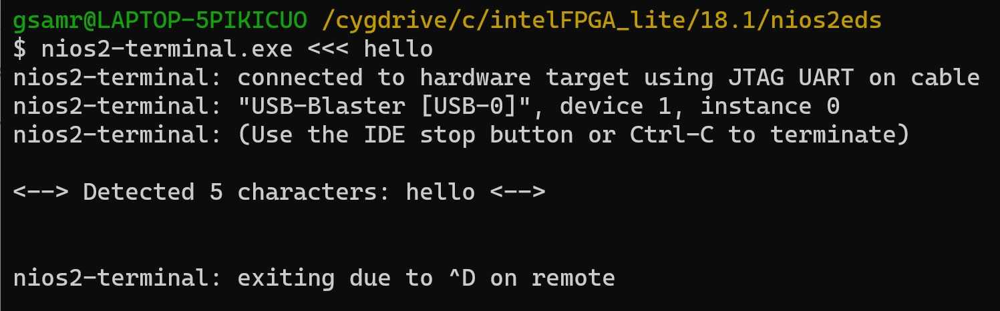
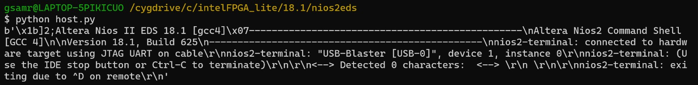

# Lab 4 Coursework #

## Task 1 ## 

In this task we configure and enable UART communication betweena host and the FPGA NIOS II. We tested this by running first the command ('nios2-terminal.exe <<< hello') This gave the following:

We then ran the python host file:

---
## Task 2 ##

## Task 2 (Challenges) ##
