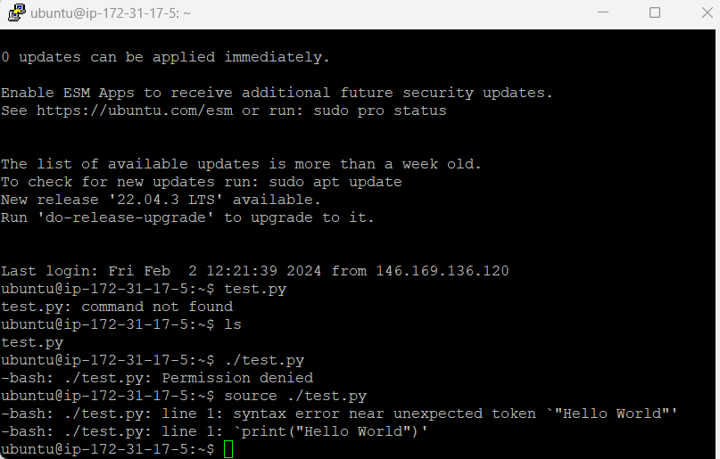
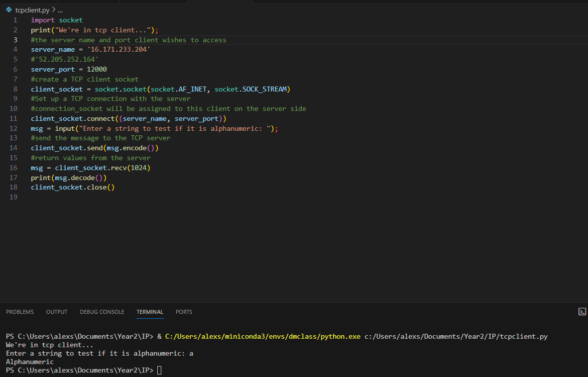
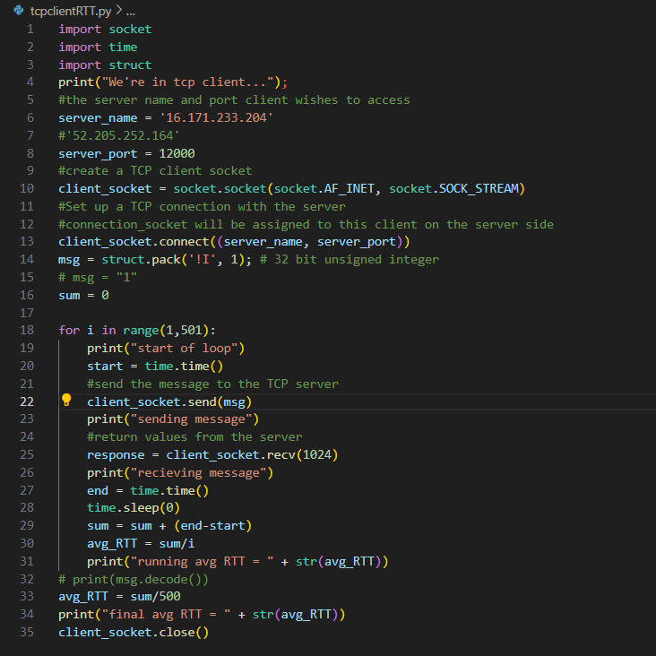
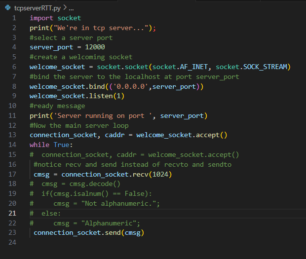
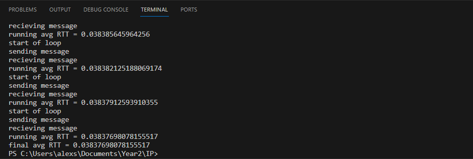

# Lab 5 Coursework #

## Task 1 ## 

Task 1 was mostly just setting up AWS PuTTy and FileZilla.

Below is proof of the server working:

---
## Task 2 ##

We now had to get the client and server communicating using the python files given to us.

Below is proof of the Client and server working together:

## Task 2 (Challenges) ##

The first challenge was measuring the RTT of the connection when transmitting integers, below are the ammendments to the original client/server python files in order to do this:

Client changes:

Server changes:

Which gave us a final result of:

0.0384 seconds!