# Lab 6 Coursework #

## Task 1 ## 

Task 1 was to download and install boto3. Boto3 is an AWS SDK. The 2 commands below did this:

``` ubuntu
$ sudo apt-get update
$ sudo apt-get -y install python3-boto3
```

---
## Task 2 ##

In task 2 we used python files to:

- Create
- Modify
- Insert
- Update
- Query
- and Delete

A table of movie data

**CREATE TABLE**

First we created the table by running the code MoviesCreateTable.py, by running the following command:

```
$ python3 MoviesCreateTable.py
```
Which ahd the following code:

``` python
import boto3

def create_movie_table(dynamodb=None):
    if not dynamodb:
        dynamodb = boto3.resource('dynamodb',region_name='us-east-1')

    table = dynamodb.create_table(
        TableName='Movies',
        KeySchema=[
            {
                'AttributeName': 'year',
                'KeyType': 'HASH'  # Partition key
            },
            {
                'AttributeName': 'title',
                'KeyType': 'RANGE'  # Sort key
            }
        ],
        AttributeDefinitions=[
            {
                'AttributeName': 'year',
                'AttributeType': 'N'
            },
            {
                'AttributeName': 'title',
                'AttributeType': 'S'
            },

        ],
        ProvisionedThroughput={
            'ReadCapacityUnits': 10,
            'WriteCapacityUnits': 10
        }
    )
    return table


if __name__ == '__main__':
    movie_table = create_movie_table()
    print("Table status:", movie_table.table_status)
```

This code connects to dynamoDB and then instantiates the movie table. This means it defines the primary key as compisite key made up of the partition and sort key. In this case we have defined the partition key to be the year and the sort key as the movie title.

Then to see the tables we ran the code:

```
$ python3
>>> import boto3
>>> db = boto3.resource('dynamodb', region_name='us-east-1')
>>> print(list(db.tables.all()))
>>>exit()

```

Which outputted:

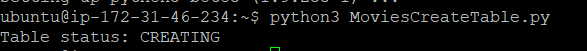

**LOAD DATA**

We then loaded the data into the table using the following command:

```
$ python3 MoviesLoadData.py
```

Which ran the following code:

``` python
from decimal import Decimal
import json
import boto3
def load_movies(movies, dynamodb=None):
    if not dynamodb:
        dynamodb = boto3.resource('dynamodb', region_name='us-east-1')
    table = dynamodb.Table('Movies')
    for movie in movies:
        year = int(movie['year'])
        title = movie['title']
        print("Adding movie:", year, title)
        table.put_item(Item=movie)
if __name__ == '__main__':
    with open("moviedata.json") as json_file:
        movie_list = json.load(json_file, parse_float=Decimal)
    load_movies(movie_list)
```
This code takes all the data from the JSON file and formats it correctly, based on the partition and sort key, into the movie table


**CREATE ITEM**

We then created an item using the following command:

```
$ python3 MoviesItemOps01.py
```

Which ran the following code:

``` python
from pprint import pprint
import boto3

def put_movie(title, year, plot, rating, dynamodb=None):
    if not dynamodb:
        dynamodb = boto3.resource('dynamodb', region_name='us-east-1')

    table = dynamodb.Table('Movies')
    response = table.put_item(
       Item={
            'year': year,
            'title': title,
            'info': {
                'plot': plot,
                'rating': rating
            }
        }
    )
    return response


if __name__ == '__main__':
    movie_resp = put_movie("The Big New Movie", 2015,
                           "Nothing happens at all.", 0)
    print("Put movie succeeded:")
    pprint(movie_resp)


```
This code inserts a new item into the the database. It does this by connecting to dynamoDB and then defining the new item based on the paramters passed into the function.

Which outputted:

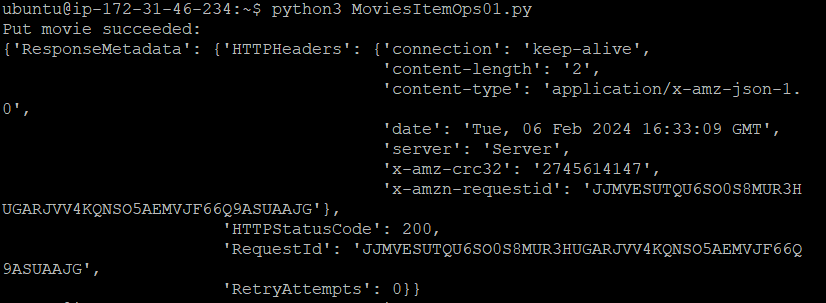

**READ ITEM**

We then readed the item using the following command:

``` 
$ python3 MoviesItemOps02.py
```

Which ran the following code:

``` python
from pprint import pprint
import boto3
from botocore.exceptions import ClientError


def get_movie(title, year, dynamodb=None):
    if not dynamodb:
        dynamodb = boto3.resource('dynamodb', region_name='us-east-1')

    table = dynamodb.Table('Movies')

    try:
        response = table.get_item(Key={'year': year, 'title': title})
    except ClientError as e:
        print(e.response['Error']['Message'])
    else:
        return response['Item']


if __name__ == '__main__':
    movie = get_movie("The Big New Movie", 2015,)
    if movie:
        print("Get movie succeeded:")
        pprint(movie)


```
This is a simple read which is performed based on the primary key. NoSQL DBs can only perform queries based only on parts or all of the primary key. In this case we get the movie passed through via the parameters and then get that from the movies table.

Which outputted:

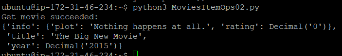

**UPDATE ITEM**

We then updated the item using the following command:

```
$ python3 MoviesItemOps03.py
```

Which ran the following code:

``` python
from decimal import Decimal
from pprint import pprint
import boto3


def update_movie(title, year, rating, plot, actors, dynamodb=None):
    if not dynamodb:
        dynamodb = boto3.resource('dynamodb', region_name='us-east-1')

    table = dynamodb.Table('Movies')

    response = table.update_item(
        Key={
            'year': year,
            'title': title
        },
        UpdateExpression="set info.rating=:r, info.plot=:p, info.actors=:a",
        ExpressionAttributeValues={
            ':r': Decimal(rating),
            ':p': plot,
            ':a': actors
        },
        ReturnValues="UPDATED_NEW"
    )
    return response


if __name__ == '__main__':
    update_response = update_movie(
        "The Big New Movie", 2015, 5.5, "Everything happens all at once.",
        ["Larry", "Moe", "Curly"])
    print("Update movie succeeded:")
    pprint(update_response)
```
This code takes the value from the movie passed through (its title and release year) and then updates the values associated with them with the newly defined values.

Which outputted:

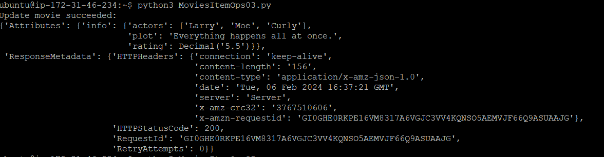

**DELETE ITEM**

We then deleted the item using the following command:

```
$ python3 MoviesItemOps04.py
```

Which ran the following code:

``` python
from decimal import Decimal
from pprint import pprint
import boto3
from botocore.exceptions import ClientError


def delete_underrated_movie(title, year, rating, dynamodb=None):
    if not dynamodb:
        dynamodb = boto3.resource('dynamodb', region_name='us-east-1')

    table = dynamodb.Table('Movies')

    try:
        response = table.delete_item(
            Key={
                'year': year,
                'title': title
            },
            ConditionExpression="info.rating <= :val",
            ExpressionAttributeValues={
                ":val": Decimal(rating)
            }
        )
    except ClientError as e:
        if e.response['Error']['Code'] == "ConditionalCheckFailedException":
            print(e.response['Error']['Message'])
        else:
            raise
    else:
        return response


if __name__ == '__main__':
    print("Attempting a conditional delete...")
    delete_response = delete_underrated_movie("The Big New Movie", 2015, 10)
    if delete_response:
        print("Delete movie succeeded:")
        pprint(delete_response)
```
This code performs a conditional delete on items in the database. It does this by passing through a value which refers to the rating of the movies. In this case the condition is that the data is deleted if the rating is less than the value passed through then it is deleted.

Which outputted:

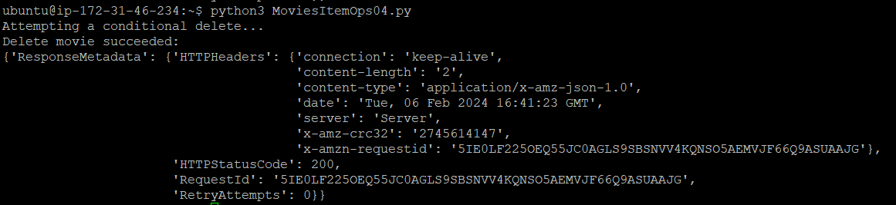

**QUERY 1**

We then ran the query to get all movies in 1985 using the following command:

```
$ python3 MoviesQuery01.py
```

Which ran the following code:

``` python
import boto3
from boto3.dynamodb.conditions import Key

def query_movies(year, dynamodb=None):
    if not dynamodb:
        dynamodb = boto3.resource('dynamodb', region_name='us-east-1')

    table = dynamodb.Table('Movies')
    response = table.query(
        KeyConditionExpression=Key('year').eq(year)
    )
    return response['Items']


if __name__ == '__main__':
    query_year = 1985
    print(f"Movies from {query_year}")
    movies = query_movies(query_year)
    for movie in movies:
        print(movie['year'], ":", movie['title'])


```
This query is performed based on the partition key of year. It takes the all the movies from a defined year and checks if their respective partition key before O/Ping.

Which outputted:

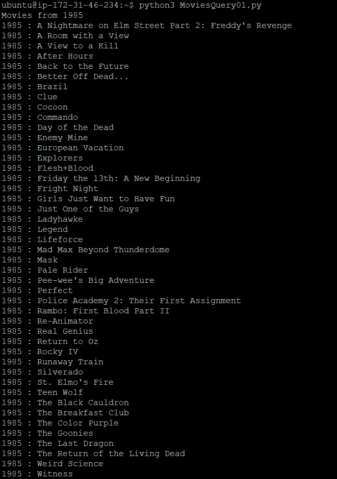

**QUERY 2**

We then ran the query to get all movies in 1992 with certain titles using the following command:

```
$ python3 MoviesQuery02.py
```

Which ran the following code:

``` python
from pprint import pprint
import boto3
from boto3.dynamodb.conditions import Key


def query_and_project_movies(year, title_range, dynamodb=None):
    if not dynamodb:
        dynamodb = boto3.resource('dynamodb', region_name='us-east-1')

    table = dynamodb.Table('Movies')
    print(f"Get year, title, genres, and lead actor")

    # Expression attribute names can only reference items in the projection expression.
    response = table.query(
        ProjectionExpression="#yr, title, info.genres, info.actors[0]",
        ExpressionAttributeNames={"#yr": "year"},
        KeyConditionExpression=
            Key('year').eq(year) & Key('title').between(title_range[0], title_range[1])
    )
    return response['Items']


if __name__ == '__main__':
    query_year = 1992
    query_range = ('A', 'L')
    print(f"Get movies from {query_year} with titles from "
          f"{query_range[0]} to {query_range[1]}")
    movies = query_and_project_movies(query_year, query_range)
    for movie in movies:
        print(f"\n{movie['year']} : {movie['title']}")
        pprint(movie['info'])
```
This query now does a query based on both the partition and the sort key. It takes all movies from 1992 which have titles ranging from A->L. It then O/Ps the title, genre and actors.

Which outputted:


**SCAN DATA**

We then scanned the table using the following command:

```
$ python3 MoviesScan.py
```

Which ran the following code:

``` python

from pprint import pprint
import boto3
from boto3.dynamodb.conditions import Key


def scan_movies(year_range, display_movies, dynamodb=None):
    if not dynamodb:
        dynamodb = boto3.resource('dynamodb', region_name='us-east-1')

    table = dynamodb.Table('Movies')

    #scan and get the first page of results
    response = table.scan(FilterExpression=Key('year').between(year_range[0], year_range[1]));
    data = response['Items']
    display_movies(data)

    #continue while there are more pages of results
    while 'LastEvaluatedKey' in response:
        response = table.scan(FilterExpression=Key('year').between(year_range[0], year_range[1]), ExclusiveStartKey=response['LastEvaluatedKey'])
        data.extend(response['Items'])
        display_movies(data)

    return data

if __name__ == '__main__':
    def print_movies(movies):
        for movie in movies:
            #print(f"\n{movie['year']} : {movie['title']}")
            #pprint(movie['info'])
            pprint(movie)

    query_range = (1950, 1959)
    print(f"Scanning for movies released from {query_range[0]} to {query_range[1]}...")
    scan_movies(query_range, print_movies)
```
This code performs a scan which is necessary in order to perform queries over multiple partitions. In this case we want to perform a scan to get all the movies which lie between 1960->1959.

Which outputted:

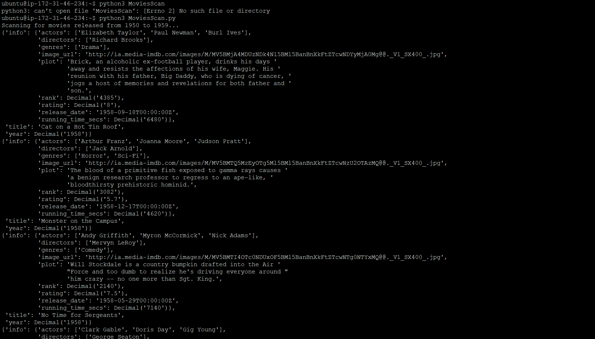

**DELETE TABLE**

Finally we deleted the table using the following command:

```
$ python3 MoviesDeleteTable.py
```

Which ran the following code:
``` python
import boto3

def delete_movie_table(dynamodb=None):
    if not dynamodb:
        dynamodb = boto3.resource('dynamodb', region_name="us-east-1")

    table = dynamodb.Table('Movies')
    table.delete()


if __name__ == '__main__':
    delete_movie_table()
    print("Movies table deleted.")
```
This code simply performs an API call to delete the movies table.

Which outputted:

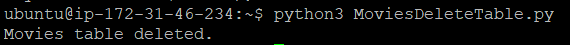

## Task 2 (Challenges) ##

1. **Print all Movies in 1994**

To do this we wrote the following code:

``` python
## Print all Movies in 1994 ##

import boto3
from boto3.dynamodb.conditions import Key

def query_movies(year, dynamodb=None):
    if not dynamodb:
        dynamodb = boto3.resource('dynamodb', region_name='us-east-1')

    table = dynamodb.Table('Movies')
    response = table.query(
        KeyConditionExpression=Key('year').eq(year)
    )
    return response['Items']


if __name__ == '__main__':
    query_year = 1994
    print(f"Movies from {query_year}")
    movies = query_movies(query_year)
    for movie in movies:
        print(movie['year'], ":", movie['title'])
        
```

Which outputed:

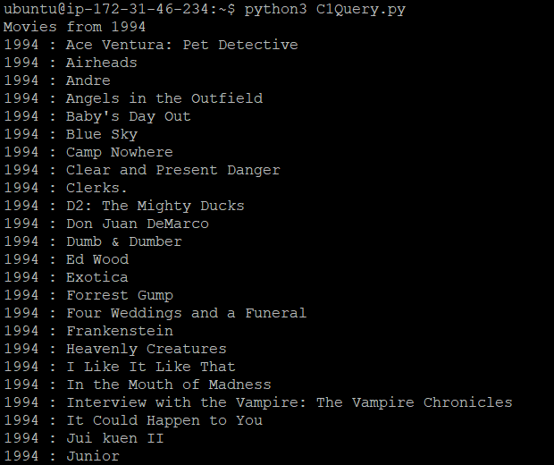

---


2. **Print complete information on the movie 'After Hours' Released in 1985**

To do this we wrote the following code:

``` python
## Print complete information on the movie 'After Hours' Released in 1985 ##

from pprint import pprint
import boto3
from boto3.dynamodb.conditions import Key

def query_movies(year, title, dynamodb=None):
    if not dynamodb:
        dynamodb = boto3.resource('dynamodb', region_name='us-east-1')

    table = dynamodb.Table('Movies')
    response = table.query(
        ProjectionExpression="#yr, #tl, info.genres, info.actors[0]",
        ExpressionAttributeNames={
        "#yr": "year",
        "#tl": "title"
        },
        KeyConditionExpression=Key('year').eq(year) & Key('title').eq(title)
    )
    return response['Items']


if __name__ == '__main__':
    query_year = 1985
    query_title = 'After Hours'
    print(f"All info on {query_title}")
    movies = query_movies(query_year, query_title)
    for movie in movies:
        print(f"\n{movie['year']} : {movie['title']}")
        pprint(movie['info'])
```

Which outputed:

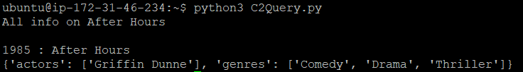

---


3. **Print all released before 2000**

To do this we wrote the following code:

``` python
## Print all released before 2000 ##

from pprint import pprint
import boto3
from boto3.dynamodb.conditions import Key


def scan_movies(year, display_movies, dynamodb=None):
    if not dynamodb:
        dynamodb = boto3.resource('dynamodb', region_name='us-east-1')

    table = dynamodb.Table('Movies')

    #scan and get the first page of results
    response = table.scan(FilterExpression=Key('year').lt(year));
    data = response['Items']
    display_movies(data)

    #continue while there are more pages of results
    while 'LastEvaluatedKey' in response:
        response = table.scan(FilterExpression=Key('year').lt(year), ExclusiveStartKey=response['LastEvaluatedKey'])
        data.extend(response['Items'])
        display_movies(data)

    return data

if __name__ == '__main__':
    def print_movies(movies):
        for movie in movies:
            print(f"\n{movie['year']} : {movie['title']}")
            #pprint(movie['info'])
            # pprint(movie)

    query_year = 2000
    print(f"Scanning for movies released before {query_year} ...")
    scan_movies(query_year, print_movies)
```
In order to do this we had to perform a scan as this would have to work across partitions (years), therefore the O/P was too large to show as it was across multiple pages.


---


4. **Print only the years and titles of movies staring Tom Hanks**

To do this we wrote the following code:

``` python
## Print only the years and titles of movies staring Tom Hanks ##

from pprint import pprint
import boto3
from boto3.dynamodb.conditions import Key, Attr

def scan_movies(actor_name, display_movies, dynamodb=None):
    if not dynamodb:
        dynamodb = boto3.resource('dynamodb', region_name='us-east-1')

    table = dynamodb.Table('Movies')

    # Scan with a filter expression to find movies where Tom Hanks is one of the actors
    response = table.scan(
        FilterExpression=Attr('info.actors').contains(actor_name)
    )
    
    data = response['Items']
    display_movies(data)

    # Continue scanning if there are more pages of results
    while 'LastEvaluatedKey' in response:
        response = table.scan(
            FilterExpression=Attr('info.actors').contains(actor_name),
            ExclusiveStartKey=response['LastEvaluatedKey']
        )
        data.extend(response['Items'])
        display_movies(data)

    return data

if __name__ == '__main__':
    def print_movies(movies):
        for movie in movies:
            print(f"\n{movie['year']} : {movie['title']}")

    query_actor = 'Tom Hanks'
    print(f"Scanning for movies starring {query_actor} ...")
    scan_movies(query_actor, print_movies)


```

Which outputed:

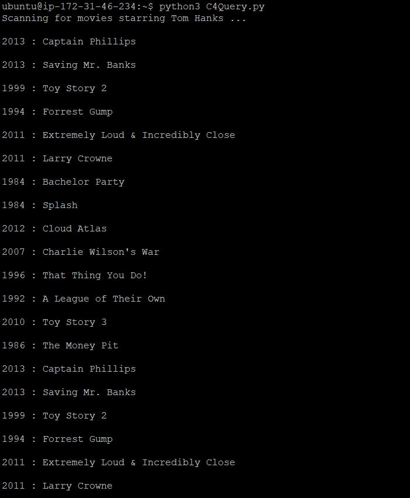


---


5. **Remove All Movies Released Before 2000**

To do this we wrote the following code:

``` python
## Remove All Movies Released Before 2000 ##

from decimal import Decimal
from pprint import pprint
import boto3
from boto3.dynamodb.conditions import Key
from botocore.exceptions import ClientError


def delete_movies_before(year, dynamodb=None):
    if not dynamodb:
        dynamodb = boto3.resource('dynamodb', region_name='us-east-1')

    table = dynamodb.Table('Movies')

    # Scan the table to get all movies released before the specified year
    response = table.scan(
        FilterExpression=Key('year').lt(year)
    )

    # Delete each item found in the scan
    for item in response['Items']:
        try:
            table.delete_item(
                Key={
                    'year': item['year'],
                    'title': item['title']
                }
            )
            print(f"Deleted: {item['title']} ({item['year']})")
        except ClientError as e:
            print(f"Failed to delete {item['title']} ({item['year']}): {e}")

    return response['Items']


if __name__ == '__main__':
    print("Attempting to delete movies released before 2000...")
    query_year = 2000
    deleted_items = delete_movies_before(query_year)
    print(f"Deleted {len(deleted_items)} movies released before {query_year}.")

```

NOTE: We needed a scan for this also because we were working across partitions

Which outputed:

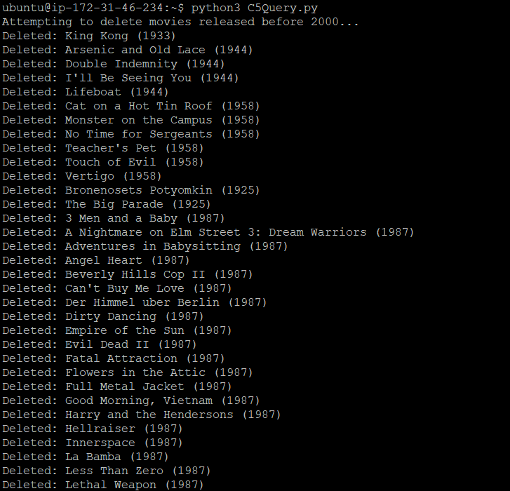


